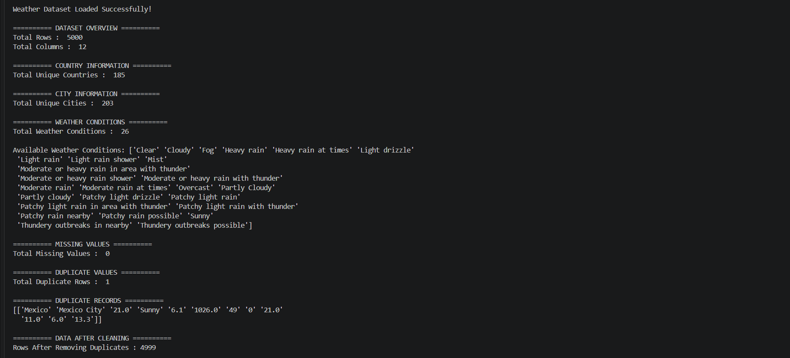
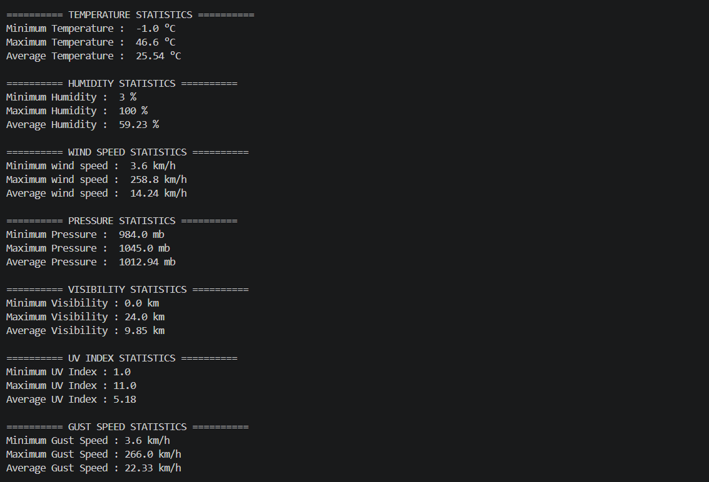
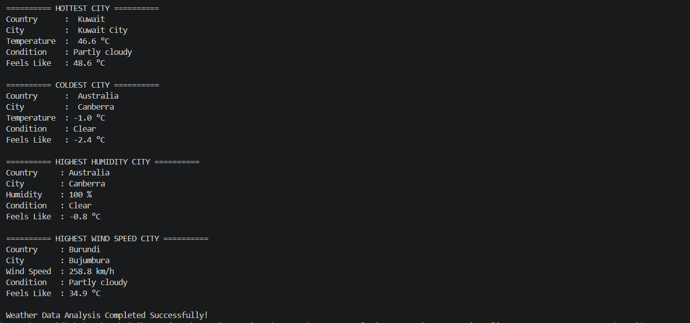

# 🌦 Weather Data Analysis using NumPy

A beginner-friendly Weather Data Analysis project built using **Python** and **NumPy**. This project demonstrates how to load, clean, analyze, and summarize weather data.

---

# 📖 Project Overview

This project analyzes a global weather dataset using only **NumPy**.

The project performs:

- Reading CSV files using NumPy
- Selecting required columns
- Data cleaning
- Missing value detection
- Duplicate value detection
- Basic statistical analysis
- Weather insights for different cities

This project was created as a practice project to strengthen NumPy fundamentals for Data Analysis.

---

# 🚀 Features

- ✅ Dynamic File Path
- ✅ Read CSV using NumPy
- ✅ Header Extraction
- ✅ Required Column Selection
- ✅ Dataset Overview
- ✅ Unique Countries
- ✅ Unique Cities
- ✅ Weather Conditions
- ✅ Missing Value Detection
- ✅ Duplicate Value Detection
- ✅ Remove Duplicate Records
- ✅ Temperature Statistics
- ✅ Humidity Statistics
- ✅ Wind Speed Statistics
- ✅ Pressure Statistics
- ✅ Visibility Statistics
- ✅ UV Index Statistics
- ✅ Gust Speed Statistics
- ✅ Hottest City Detection
- ✅ Coldest City Detection
- ✅ Highest Humidity City
- ✅ Highest Wind Speed City

---

# 🛠 Technologies Used

- Python
- NumPy
- VS Code

---

# 📂 Project Structure

```text
02_Weather_Data_Analysis_NumPy
│
├── 01_Dataset
│   └── GlobalWeatherRepository.csv
│
├── 02_Outputs
│   ├── 01_Dataset_Overview.png
│   ├── 02_Statistics.png
│   └── 03_City_Analysis.png
│
├── .gitignore
├── 03_weather_analysis.py
├── requirements.txt
└── README.md
```

---

# 📊 Dataset Overview

- Total Records Analysed : **5000**
- Selected Columns : **12**
- Unique Countries : **185**
- Unique Cities : **203**
- Weather Conditions : **26**

---

# 📈 Statistical Analysis

The project calculates:

- Minimum Temperature
- Maximum Temperature
- Average Temperature

- Minimum Humidity
- Maximum Humidity
- Average Humidity

- Minimum Wind Speed
- Maximum Wind Speed
- Average Wind Speed

- Minimum Pressure
- Maximum Pressure
- Average Pressure

- Minimum Visibility
- Maximum Visibility
- Average Visibility

- Minimum UV Index
- Maximum UV Index
- Average UV Index

- Minimum Gust Speed
- Maximum Gust Speed
- Average Gust Speed

---

# 🌍 Weather Insights

The project also identifies:

- 🔥 Hottest City
- ❄ Coldest City
- 💧 Highest Humidity City
- 🌪 Highest Wind Speed City

---

# 📸 Project Output

## Dataset Overview



---

## Statistical Analysis



---

## City Analysis



---

## ▶️ How to Run

Clone this repository

```bash
git clone https://github.com/kaushikjivika-png/Practice-Projects.git
```

Go to project folder

```bash
cd Practice-Projects/02_Weather_Data_Analysis_NumPy
```

Install NumPy

```bash
pip install -r requirements.txt
```

Run the project

```bash
python 03_weather_analysis.py
```

---

# 📚 Learning Outcomes


Through this project, I practiced the following NumPy concepts:

- NumPy Array Operations
- Reading CSV files using NumPy
- Data Cleaning
- Data Analysis
- Statistical Functions
- Boolean Indexing
- Duplicate Detection
- Missing Value Detection
- NumPy Aggregation Functions

---

# 👩‍💻 Author

**Jivika Kaushik**

Aspiring Data Analyst | Python | SQL | NumPy | Data Analytics

---

⭐ If you like this project, feel free to star the repository.