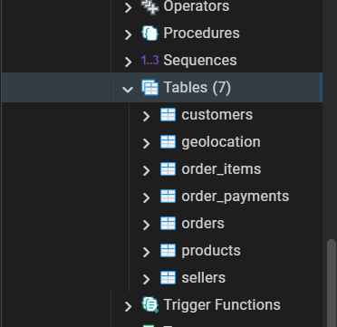
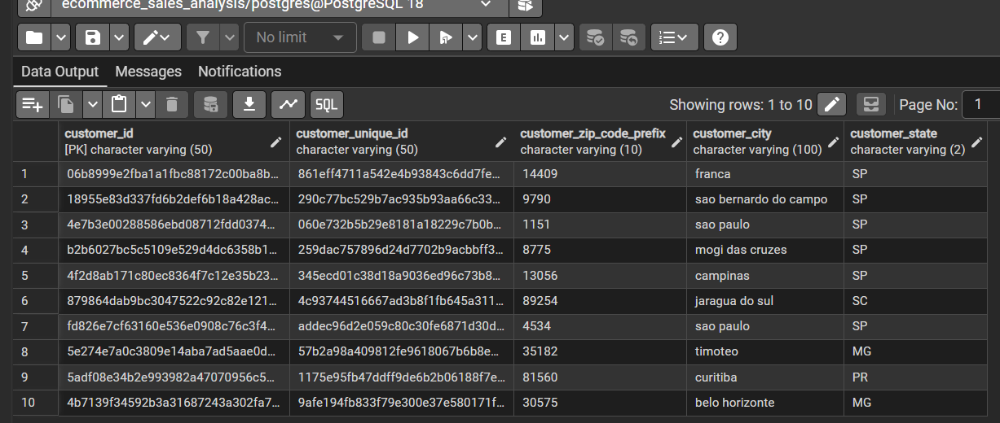
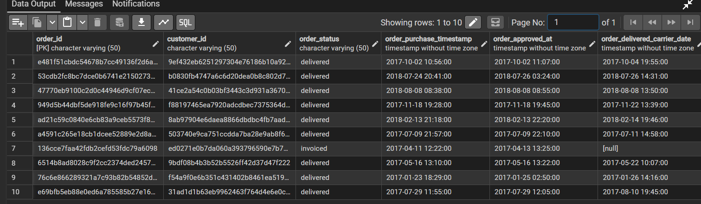
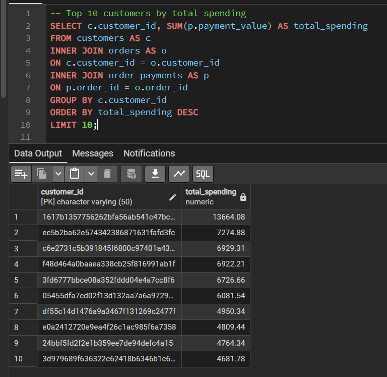
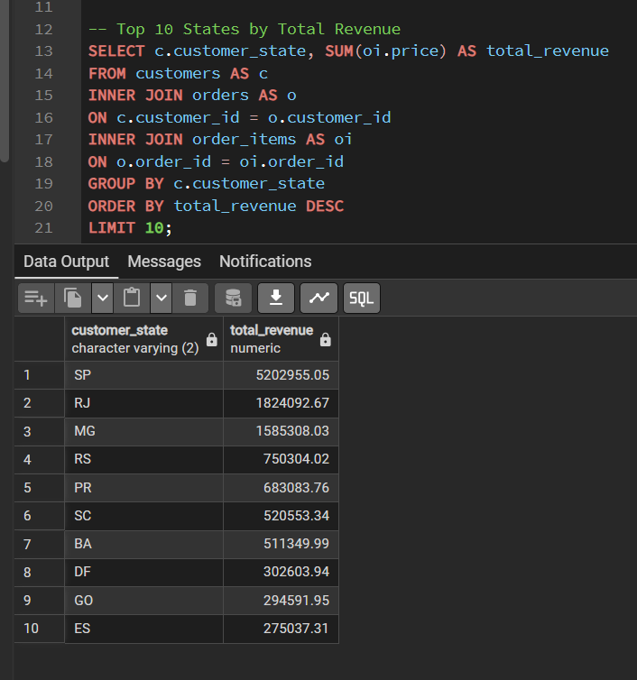
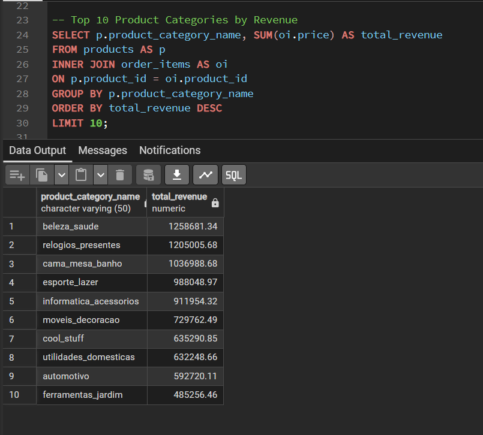
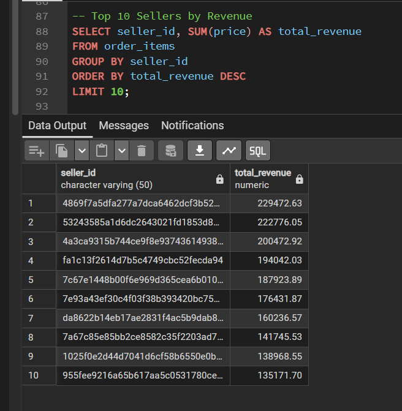
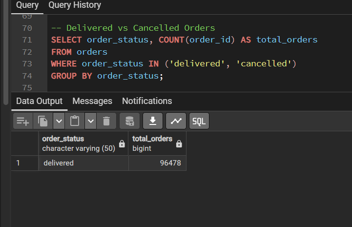

# E-Commerce Sales Analysis using SQL (PostgreSQL)

A SQL-based data analysis project built using the Olist Brazilian E-Commerce dataset. This project demonstrates database creation, data validation, exploratory data analysis (EDA), and business analysis using PostgreSQL.

---

## Project Objectives

- Analyze customer purchasing behavior.
- Identify top-performing sellers and product categories.
- Measure revenue across different dimensions.
- Analyze payment methods and order trends.
- Practice real-world SQL queries used in Data Analyst roles.

---

## Tools & Technologies

- PostgreSQL
- pgAdmin 4
- SQL
- Git
- GitHub

---

## Database Tables

| Table Name | Description |
|------------|-------------|
| customers | Customer information |
| orders | Order details |
| order_items | Products included in each order |
| order_payments | Payment information |
| products | Product details |
| sellers | Seller information |
| geolocation | Customer location details |

---

## Project Structure

```
03_E-Commerce_Sales_Analysis_SQL
│
├── 01_Dataset
│
├── 02_SQL_Files
│   ├── 01_create_tables.sql
│   ├── 02_data_validation.sql
│   ├── 03_eda.sql
│   └── 04_business_analysis.sql
│
├── 03_Documentation
│
├── 04_Output
│   ├── 01_database_tables.png
│   ├── 02_customers_preview.png
│   ├── 03_orders_preview.png
│   ├── 04_top_customers_spending.png
│   ├── 05_revenue_by_state.png
│   ├── 06_top_product_categories.png
│   ├── 07_top_sellers.png
│   └── 08_order_status.png
│
├── README.md
└── .gitignore
```

---

## SQL Concepts Used

- SELECT
- WHERE
- GROUP BY
- HAVING
- ORDER BY
- Aggregate Functions
- COUNT()
- SUM()
- AVG()
- MIN()
- MAX()
- INNER JOIN
- LEFT JOIN
- DISTINCT
- LIMIT
- Subqueries

---

## Exploratory Data Analysis

The following analyses were performed:

- Total Orders
- Total Customers
- Unique Customers
- Order Date Range
- Order Status Distribution
- Total Products
- Total Sellers
- Payment Type Distribution
- Average Payment Value
- Minimum & Maximum Payment Value
- Top Product Categories
- Top Customer Cities
- Top Customer States
- Average Product Price
- Total Freight Cost
- Top Sellers by Revenue

---

## Business Analysis

The following business questions were answered:

- Top Customers by Total Spending
- Revenue by State
- Top Product Categories by Revenue
- Top Sellers by Number of Orders
- Revenue by Payment Type
- Top Customers by Number of Orders
- Customers with More Than Five Orders
- Average Order Value
- Delivered vs Cancelled Orders
- Top Cities by Revenue
- Top Sellers by Revenue
- Average Revenue per Seller
- Revenue by Seller State
- Average Freight Cost by Seller

---

# Project Screenshots

## Database Tables



---

## Customers Table Preview



---

## Orders Table Preview



---

## Top Customers by Total Spending



---

## Revenue by State



---

## Top Product Categories by Revenue



---

## Top Sellers by Revenue



---

## Delivered vs Cancelled Orders



---

## Key Insights

- A small group of customers contributes a significant share of total revenue.
- Revenue is concentrated in a few customer states.
- Some product categories generate substantially higher revenue than others.
- Seller performance varies significantly across the marketplace.
- Credit Card is one of the most frequently used payment methods.
- Most orders are successfully delivered, while cancelled orders represent only a small percentage of total orders.

---

## Skills Demonstrated

- SQL Query Writing
- Relational Database Design
- Data Validation
- Exploratory Data Analysis (EDA)
- Business Analysis
- SQL Joins
- Aggregate Analysis
- Subqueries
- Business Problem Solving

---

## Future Improvements

- Window Functions
- Common Table Expressions (CTEs)
- SQL Views
- Power BI Dashboard
- Tableau Dashboard

---

## Author

**Jivika Kaushik**

Aspiring Data Analyst
